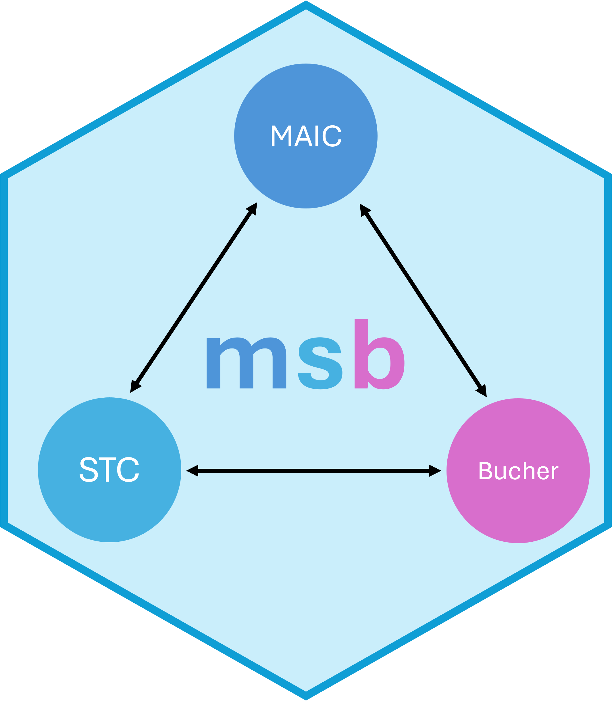

# msb: Simulation of the Indirect Comparison Methods MAIC, STC, and the Bucher Method 

## Overview

The `msb` package provides tools to simulate and evaluate the performance of three indirect comparison methods:

- **MAIC** (Matching-Adjusted Indirect Comparison)
- **STC** (Simulated Treatment Comparison) 
- **Bucher Method**

*This package was developed as part of a university research project in the third year of my undergraduate degree, whilst also working full-time as a programmer at a pharmaceutical company.*

## Features

- **Data Generation**: Generate synthetic trial data.
- **Simulation Implementation**: Apply MAIC, STC, and Bucher methods to your data with the desired number of simulation runs.
- **Analysis**: Calculate performance metrics such as bias, standard errors, and coverage.
- **Visualisation**: Create plots and tables.

**Adjustable Parameters**:

- **Sample Size** - Examine how methods perform with varying trial sizes
- **Population Overlap** - Assess impact of different degrees of patient population similarity between studies
- **Effect Modifier Strength** - Evaluate sensitivity to the magnitude of treatment effect modification
- **Adjustment Strategy** - Compare full versus partial adjustment for effect modifiers to understand the trade-offs in bias reduction

The package enables exploration of how these four parameters influence the comparative performance of indirect comparison methods, allowing users to understand when each approach is most appropriate for their specific research context.

## Installation

You can install `msb` from GitHub:

```r
# Install from GitHub
devtools::install_github("lilyn09/msb")
```

## Example Workflow

### Select Parameters and Run Simulation

```r
library(msb)

# Run Simulations with N = 100, overlap = 0.5 and 0.75
sim_1 <- do_simulation(N_sim = 100, 
                       data_overlap_param = 0.5)

sim_2 <- do_simulation(N_sim = 100, 
                       data_overlap_param = 0.75)
```

### Analyse Simulation Data
```r
analysis_1 <- analyse_simulations(sim_1)

analysis_2 <- analyse_simulations(sim_2) 
```
### Generate Tables

```r
format_table(analysis_1$shared_results)
format_table(analysis_2$shared_results)
```

### Plot Bias

```
datasets <- list(analysis_1$shared_results, analysis_2$shared_results)
facet_bias_plot(datasets = datasets, 
                facet_names = c("Overlap = 0.5", "Overlap = 0.75"))
```

### Plot Standard Errors
```r
facet_se_plot(datasets = datasets, 
              facet_names = c("Overlap = 0.5", "Overlap = 0.75"))
```

### Plot Coverage
```r
datasets <- list(sim_1$results_df, sim_2$results_df)
facet_coverage_plot(datasets = datasets, 
                facet_names = c("Overlap = 0.5", "Overlap = 0.75"))
```

## References

- Phillippo, D., S. Dias, A. Ades, and N. Welton (2020). Assessing the performance of population adjustment
methods for anchored indirect comparisons: A simulation study. Statistics in Medicine 39, 4885–4911.
- Phillippo, D., A. Ades, S. Dias, S. Palmer, K. Abrams, and N. Welton (2016). NICE DSU Technical Support
Document 18: Methods for population-adjusted indirect comparisons in submission to NICE. Technical
support document, NICE Decision Support Unit.


